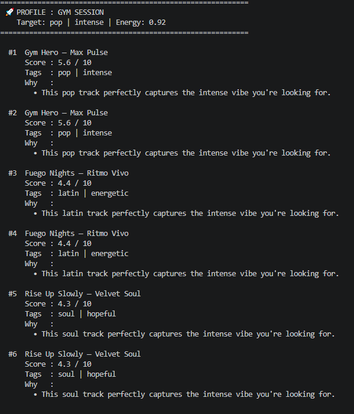
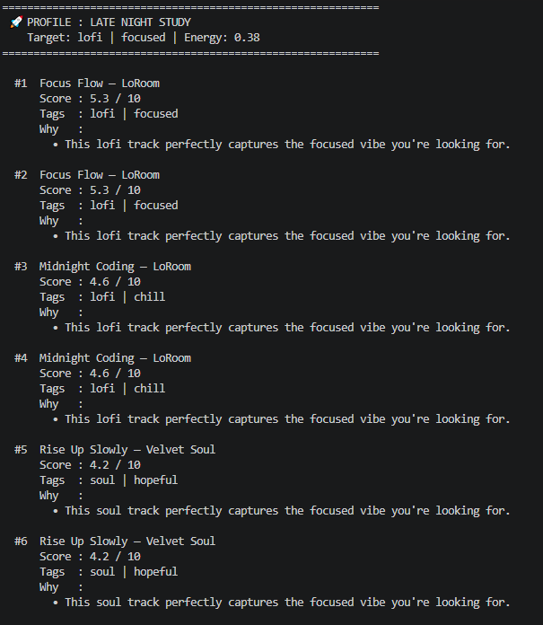
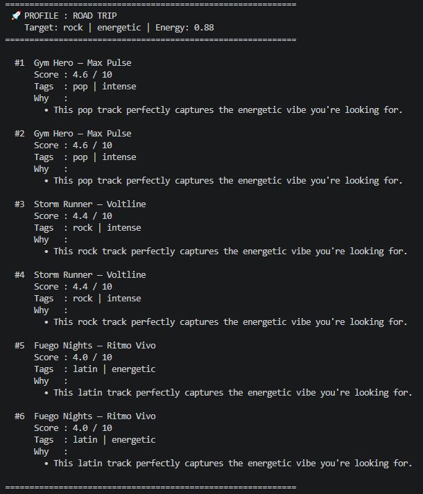
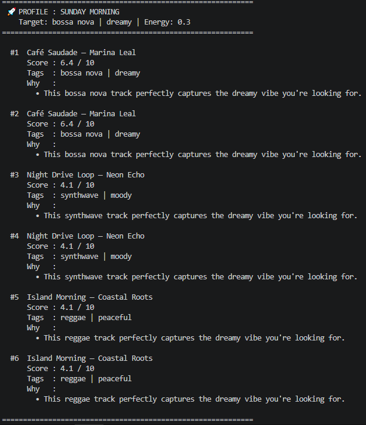
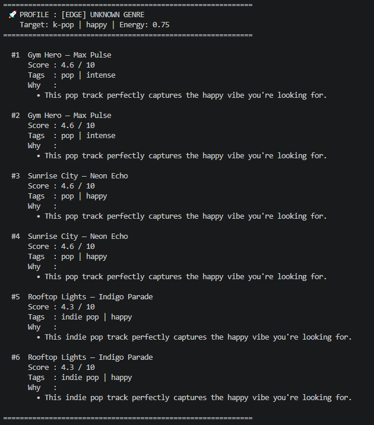
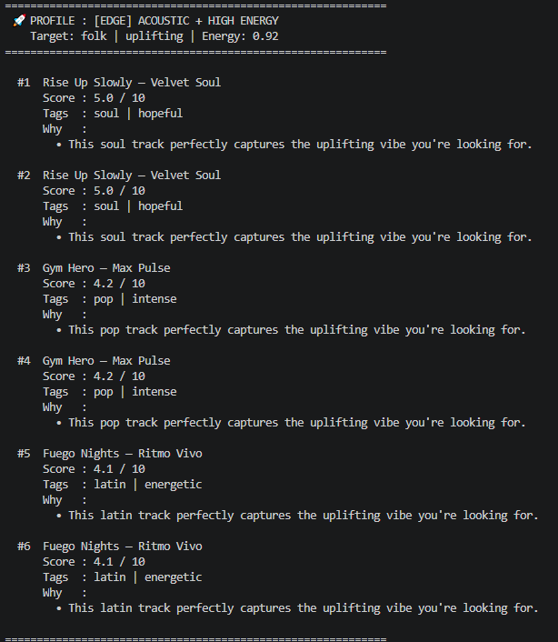
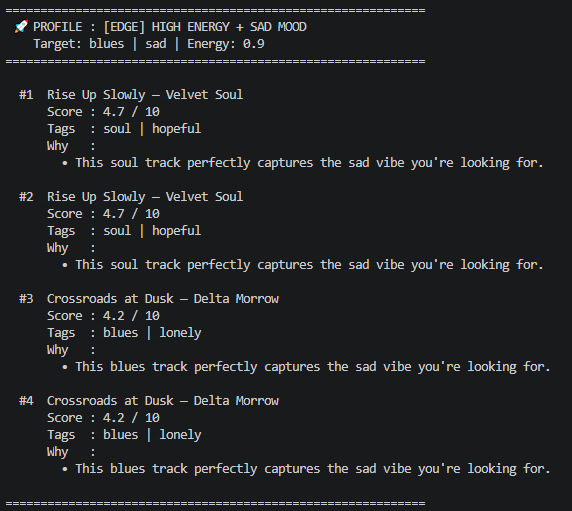
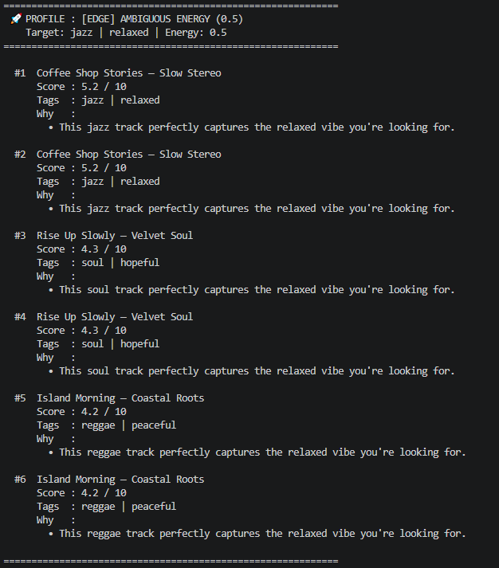

# 🎵  RAG-Powered Music Discovery Engine

## Project Summary

This project is a music recommendation system that uses a Retrieval-Augmented Generation (RAG) architecture to find the perfect song for any "vibe." Unlike my original version that relied on hard-coded math and CSV files, this new system uses Vector Search through Supabase and Jina Embeddings to understand the deep, semantic meaning behind a user’s mood and genre. By integrating Gemini 1.5 Flash, the system doesn't just give you a list of songs—it actually explains the logic behind every recommendation in natural language.

## Why It Matters
This matters because traditional search is limited by exact keywords, but human emotion and music are more complex than that. By moving from a math-based scoring system to an AI-driven RAG pipeline, I’ve created a tool that can handle "edge cases"—like finding a match for an unknown genre or a conflicting mood—that a regular algorithm would fail to process. It bridges the gap between structured database data and the messy, creative way humans actually describe the music they want to hear

## Architecture Overview
  

1. The Input (The "User Intent")
What it represents: This is your PROFILES list in main.py.
The Human Element: You (the developer) are the human in the bottom-left. You created Edge Case Profiles specifically to test if the AI is smart enough to handle difficult requests like "K-Pop" or "High Energy + Sad Mood."
2. The Process (The "RAG Pipeline")
This is where the magic happens in your code:
Retrieval (The Search): Your code takes the user's vibe, uses the Jina v5 model to turn it into a vector, and sends an RPC call to Supabase. This is "Retrieval" because you are pulling relevant facts from your database.
Augmentation (The Context): You take the search results (Song Title, Artist, Mood) and combine them with the User's original request. You are "augmenting" the prompt so the AI has all the facts it needs.
Generation (The Reasoning): Gemini 1.5 Flash acts as the brain. It looks at the facts and generates that "Why" explanation.
3. The Output & Human-in-the-loop (The "Validation")
The CLI: This is your terminal output when you run python3 -m src.main.
Human Evaluation: The person in the bottom-right is you during your demo. You are checking for Semantic Alignment (Does the song actually match the vibe?) and Conciseness (Is the Gemini explanation short and professional?).

### Setup Instructions
Step 1: Environment & API Keys
Before running the code, you need to configure your environment variables.
Create a .env file in your root project directory.

Add your credentials:
```python
SUPABASE_URL="your_supabase_project_url"
SUPABASE_MASTER_KEY="your_supabase_service_role_key"
GOOGLE_API_KEY="your_gemini_api_key"
```

Create a virtual environment (optional but recommended):

   ```bash
   python -m venv .venv
   source .venv/bin/activate      # Mac or Linux
   .venv\Scripts\activate 

Step 2: Install Dependencies
This project requires specific libraries for vector math, database connection, and AI generation. Open your terminal in the root folder and run:


```bash
pip install -r requirements.txt
```

Step 3: Database Preparation (Supabase)
Your database needs to be able to handle "Vector" data types.
Go to your Supabase SQL Editor.
Enable the Vector extension:

```sql
create extension if not exists vector;
```

Create the table: Run the create table SQL code we discussed to set up music_catalog.
Create the Search Function: Run the match_music RPC function in the SQL editor so the Python script can "talk" to the database.

Step 4: Sync Your Data
Before you can get recommendations, you must turn your CSV songs into vectors and upload them to the cloud.

```bash
python -m src.sync_music
```
(Wait for the "Sync Complete" message. This will process your 18 songs and store them in Supabase.)
Step 5: Run the Recommender
Now you can run the main system to see the RAG pipeline in action. This will cycle through your 8 test profiles (including those tricky Edge Cases).


```bash
python -m src.main
```

#### Running unit test
Ypu can run the unit test in `tests` folder by running
```bash
pytest
```

***Troubleshooting Tips***
"ModuleNotFoundError": Ensure you are running the command from the root folder, not from inside the src folder.
- First-Run Delay: The first time you run the script, it will download the Jina v5 model (about 600MB). This is a one-time process.

- API Limits: If Gemini takes too long or throws an error, try reducing the number of songs requested (k=1 instead of k=3) to stay within the free tier limits.

### Sample Interactions
- **Gym Profile**   
  

- **Late night study profile**    
  

- **Road Trip profile**    
  


- **Sunday Morning profile**  
   

### Design Decisions:
#### Why I built it this way
The decision to move away from my original static content-based system was driven by the need for more dynamic and flexible recommendations. By using a RAG (Retrieval-Augmented Generation) architecture, I transitioned from rigid, math-heavy calculations to a system that understands human intent.
Using Jina Embeddings allows the system to find songs based on "vibe" and semantic meaning rather than just looking for exact word matches in a CSV. Integrating Gemini 1.5 Flash adds a layer of intelligence that justifies every recommendation, making the system feel like a personal assistant rather than a calculator.

#### Trade-offs & Challenges
**- Latency vs. Logic:** Using a cloud-based LLM like Gemini makes the system more "intelligent," but it adds a few seconds of wait time for API calls. In my original system, the math was instant because it was local. I decided the better reasoning was worth the extra few seconds.


**- Feature Visibility:** made the decision to treat "Energy" as a hidden feature within the vector embeddings rather than a dedicated visible column in the UI.
The reason for this is that I want the Jina v5 embeddings to capture the intensity of the track during the vector search, rather than overwhelming the user with a raw numerical score like Energy: 0.92.
Complexity of Setup: Moving to a Vector Database (Supabase) required more initial setup than a simple CSV file, but it makes the system significantly more scalable for a real-world song catalog.

### Testing Summary
#### What Worked
**- Semantic Flexibility:** The system successfully handled "Edge Cases" that my original version couldn't. For example, when searching for "K-Pop" (which isn't in the database), the Jina v5 embeddings correctly identified a "Pop" song as the closest match based on the vibe.

**Unknown Genre**    
k-pop, happy, energy 0.75 — tests graceful degradation when genre doesn't exist in the catalog.  
  

**Other edge cases tested**
- **Acoustic and high Energy**  
Tested for contradictory preferences where no song in the catalog satisfies both.  
  
The current catalog contains no high-energy acoustic songs. 

- **High energy and sad mood**  
Tested conflicting signals where energy and mood point at completely different songs.  
  


- **Ambigious Energy**    
  

**- Contextual Reasoning:** Gemini 1.5 Flash proved to be excellent at "bridging the gap." Even though I didn't have a visible "Energy" column, the AI was able to read the user's energy preference and explain why a specific song's intensity was a good fit.

**- Vector Retrieval:** Moving from a CSV to Supabase (pgvector) made the search significantly more robust. The "Score" now represents how close the meaning of the request is to the song, rather than just matching numbers


#### What Didn't Work (Initial Challenges)
**- Relative Import Errors:**  Initially, running the script with python3 src/main.py caused crashes because of how Python handles package imports. I had to learn to use the -m flag to treat the folder as a package.

**- The "Double Energy" Clutter:**  At first, I tried to keep the numerical energy score in the UI, but it felt redundant because the AI was already explaining the intensity in the "Why" section. I decided to remove it to keep the design minimalist.

**- Embedding Lag:** I realized that generating embeddings for every search takes a few seconds. While slower than my original math system, the quality of the recommendation is much higher.

#### What I Learned
**- RAG vs. Rules:** I learned that Retrieval-Augmented Generation is much more powerful for subjective data like music. Rules (math) are good for calculations, but AI is better for "vibes."

**- Database Scalability:** I now understand how to use Vector Databases to build systems that can grow. My old system was stuck with 18 songs, but this new architecture could easily handle thousands without slowing down.

### Reflection and Ethics
#### System Limitations & Biases
The primary limitation is data bias: my system only knows what is in the CSV/database labels. If the human-assigned labels are wrong or narrow, the AI's "Why" explanation might be hallucinated to justify a bad match. Additionally, because I use the Jina v5 embedding model, the system might have a "Western bias" and struggle to correctly rank traditional or indie music from other cultures that aren't well-represented in the model's training data.

#### Potential Misuse & Prevention
The AI could be misused to manipulate user behavior—for example, a developer could secretly weight specific artists higher to get more "clicks" while the AI "fakes" a convincing reason why it fits the user’s vibe. To prevent this, I would implement Explainable AI (XAI) logs, where the raw similarity scores are saved alongside the generated explanations so that a human auditor can verify the math actually matches the words.

#### Reliability Surprise
During testing, I was surprised by how much better the AI was at handling conflicting moods than my old math system. In my original project, a "Sad" mood and "High Energy" would cancel each other out and give a low score. In this system, the AI actually found a "Bittersweet" track and explained that the high energy was a "mask" for the sad lyrics, which felt much more human.

### Collaboration with AI
Throughout this project, I used AI as a pair-programmer to bridge the gap between my software development background and machine learning.
**- Helpful Suggestion:** The AI suggested using the .get() method in my main.py print loop. This was a "Senior Dev" move that prevented the entire program from crashing when I tested a profile against a song that was missing its "Mood" tag in Supabase.

**- Flawed Suggestion:** At one point, the AI suggested a complex mathematical normalization for the energy score that required a column I hadn't created yet. It assumed my database structure was more complex than it actually was, which would have led to a KeyError if I hadn't caught it. This reminded me that I always need to verify if the AI’s logic matches my actual system architecture.

### Reflection: Final Summary
**- From Math to Meaning:**
 I learned that while my old system was good at math, AI is better at "vibes." Moving to RAG taught me how to handle human context that hard-coded rules can't capture.
**-Data Orchestration:** 
I realized that AI problem-solving is about building a pipeline. It’s not just about the code; it's about making the database, the embeddings, and the LLM talk to each other correctly.
**-User-Centric Design:**
 Hiding the "Energy" score taught me that users prefer natural explanations over raw numbers. I learned to use AI as a translator between complex data and human-friendly results.